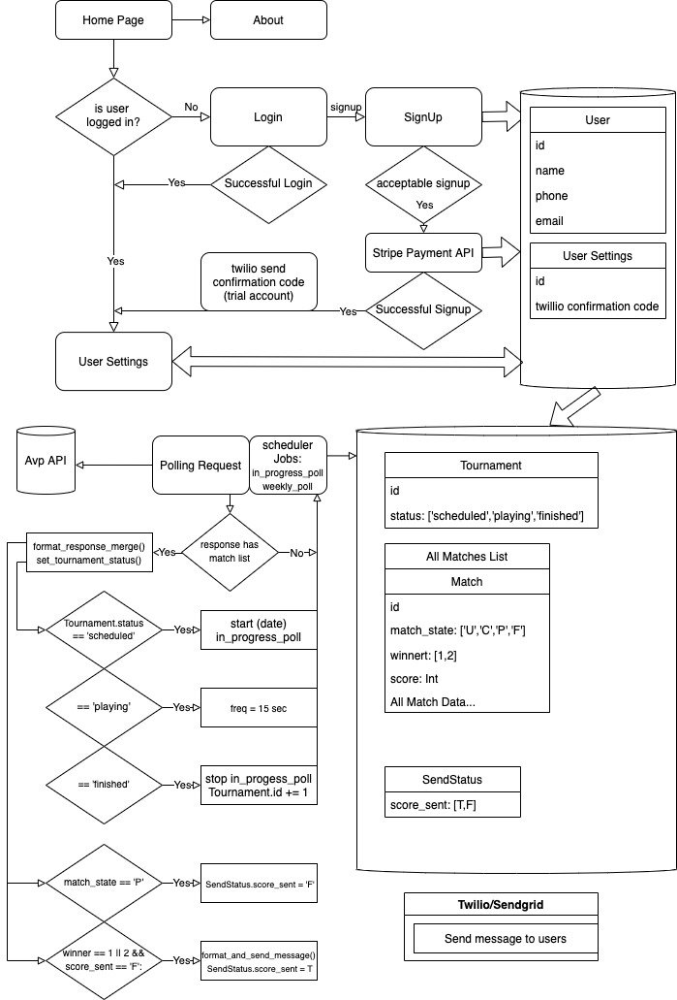

# AVP Scores
[AVP Scores](https://avp-scores.herokuapp.com/)
A SMS text alert platform for realtime AVP match results.

### What does this do?
Simply sign up with a valid phone number and email. During AVP events a live match result will be sent as a text message in real time as matches are played.. 
User information is not shared or sold and users can simply delete when to remove themselves from receiving alerts

### How does it work under the hood?
The external AVP live scoring API is polled to check for running events. once an event is found to be running the polling frequency is increased to short intervals and checks for changes in match results. once a match is discovered to be finished, the AVP API response object is formatted into a user readable text string and sent via twilio API to all users in the database at the present time. 
passwords are encrypted with bcrypt and JWTs are used for password reset functionality through the Sendgrid API.

### Tech used
* Python
* Flask
* postgresDB 
* SQLAlchemy
* Jinja Templates
* APScheduler
* Twilio
* Sendgrid

